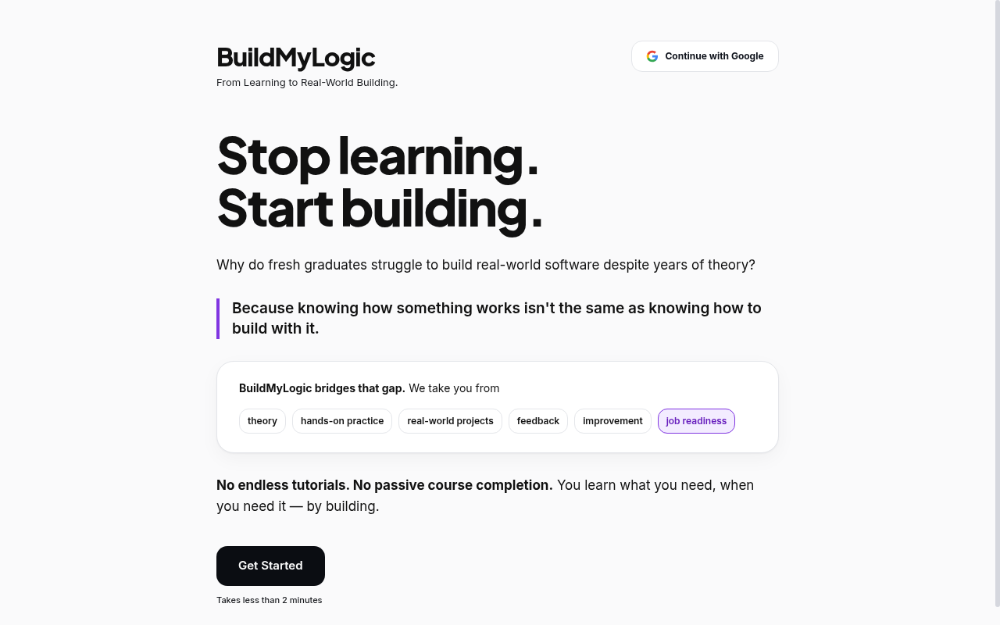
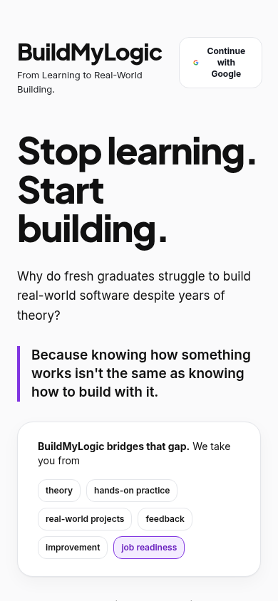

# BuildMyLogic

> **From Learning to Real-World Building.**

BuildMyLogic is a practical learning platform that helps beginners move from **knowing concepts to actually building software**.

## Screenshots

<p align="center">
  
  
</p>

## Why BuildMyLogic?

Most learning platforms measure what students can **answer**. BuildMyLogic measures what they can **build, debug, improve, and prove**.

The learning loop is:

**Learn → Build → Fail → Understand → Improve → Build again**

A learner does not receive a large project immediately. BuildMyLogic starts at their actual level and gradually increases difficulty.

## How It Works

1. **Understand the learner** — onboarding captures goals, languages, experience, and weak areas.
2. **Start small** — beginners can learn fundamentals before attempting a project.
3. **Build a real task** — missions are practical and progressively harder.
4. **Detect struggle** — tests, errors, attempts, and progress provide objective evidence.
5. **Vibe helps at the right time** — Sarvam AI gives short, beginner-friendly hints instead of immediately giving the answer.
6. **Retry and prove** — the learner fixes the problem and runs the tests again.
7. **Update the learner model** — evidence updates skills and determines the next mission.

## AI Architecture

AI is used where reasoning and explanation are useful; deterministic code handles facts.

**AI handles**
- onboarding understanding
- hints and explanations
- just-in-time theory
- session summaries
- recommendation reasoning

**Code handles**
- test results
- scores
- attempts
- session state
- difficulty progression
- skill evidence
- validation

This prevents the AI from inventing scores or deciding whether code actually passed.

### Vibe Memory

The conversation is maintained as structured session state rather than blindly sending unrelated messages.

```text
Learner state
     ↓
Current mission
     ↓
Recent conversation
     ↓
Current error / test result
     ↓
Sarvam AI
     ↓
Short hint / explanation
     ↓
Updated session state
```

Older or irrelevant context can be discarded so the learner does not get repeated or confusing advice.

## Beginner-First Learning

For example, a learner who says:

> "I don't know C loops."

should not immediately receive a difficult calculator project.

BuildMyLogic can first guide them through:

**Hello World → Variables → Sum → Difference → Multiplication → Division → Modulus → Conditions → Loops → CLI Calculator**

Each step gives a small task, checks the result, and moves forward only when the learner demonstrates understanding.

## VS Code Integration

During an active mission:

```text
BuildMyLogic
      ↓
Create session
      ↓
VS Code extension
      ↓
Write code
      ↓
Run tests
      ↓
Send result
      ↓
Struggle detection
      ↓
Vibe intervention
      ↓
Retry
      ↓
Skill evidence
```

The extension is **session-gated**. If no BuildMyLogic session is active, it does not track the workspace.

## Architecture

```text
Next.js + TypeScript
        │
        ▼
   FastAPI Backend
        │
   ┌────┴─────┐
   ▼          ▼
Database    Sarvam AI
   │
   ▼
Learner State

VS Code Extension ──► FastAPI
```

### Stack

- **Frontend:** Next.js, TypeScript, Tailwind CSS
- **Backend:** FastAPI, Python
- **Database/Auth:** Supabase
- **AI:** Sarvam AI
- **Editor:** VS Code Extension API
- **Testing:** pytest
- **Deployment:** Vercel + backend hosting

## Core Principle

BuildMyLogic is not designed to make students consume more tutorials.

It is designed to make them **better builders** through repeated practice, failure, feedback, and improvement.

> **Don't just learn the syntax. Learn how to build with it.**
